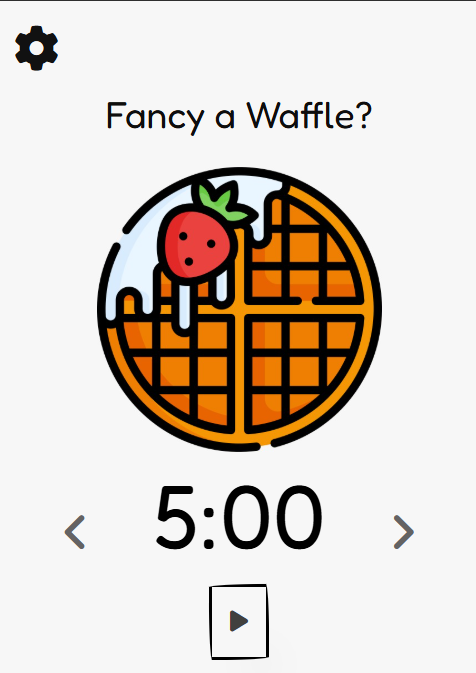
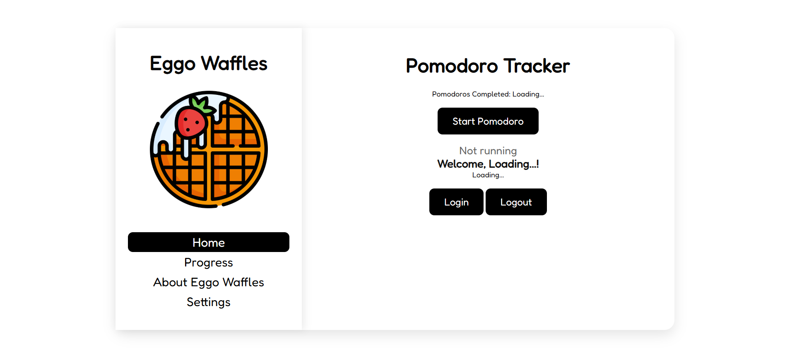

# 🧇 Eggo Waffles
A minimal and delightful Chrome Extension to help you stay productive — because productive people get the nice egg waffles 🍳✨

  

---

# Features
Pomodoro Timer. 
Very cool interface.
Potential Google Login.

---

  

--- 

# Installation Steps
Fork this repository 
Clone it to your local machine

git clone https://github.com/YOUR_USERNAME/egg-waffle-extension.git

Open Google Chrome and go to:
chrome://extensions/

Toggle Developer Mode (top right)

Click Load unpacked and select the cloned folder

Pin the extension for quick access (click the puzzle icon)

Click the Egg Waffle icon to launch it

🧇 Profit!!!!!!!!!!!

# Contact 
Feel free to contact agrimajain223@gmail.com and angaddogra1204@gmail.com!

